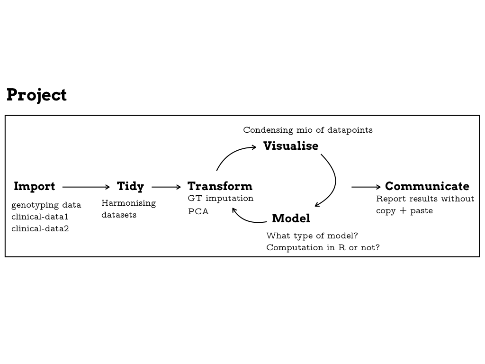

<!-- updated: sys.date())
<!-- From here: https://slides.yihui.name/xaringan/ -->

```{r setup, include=FALSE}
options(htmltools.dir.version = FALSE)
library <- function(...) suppressPackageStartupMessages(base::library(...))
knitr::opts_chunk$set(
  tidy = TRUE
)
```

---
layout: true


---
class: left, middle

# About me

- Background in Data Analysis & Engineering

- PostDoc @ EPFL `r icon::ii_arrow_right_a()` Analysis of genetic data in infectious diseases at the [Fellay Lab](https://fellay-lab.epfl.ch/).

- `r icon::fa_r_project(colour = "#88398a")`-Ladies Lausanne co-organiser


--

- `r icon::ii_heart()` Data analysis & Genetic data & Data visualisation

- `r icon::fa_question()` `usethis` package

---
class: center, middle, inverse

# My everyday work


---
class: left, middle


.small[Adapted from Figure in [R4DS book](http://r4ds.had.co.nz/explore-intro.html)]

---
class: left, middle




.small[Adapted from Figure in [R4DS book](http://r4ds.had.co.nz/explore-intro.html)]

---
class: left, middle


.small[Adapted from Figure in [R4DS book](http://r4ds.had.co.nz/explore-intro.html)]

---
class: inverse, center, middle

.big[<font face="Yanone Kaffeesatz"> Tidying workflows </font>] <!------`r icon::fa_smile()` ---------->

---
class: left, top

# The challenges

- Making it easy for other colleagues to **rerun** (and **understand**) my code → *replicability* of results.

--

- Publishing code - making it easy for others to **rerun with their data** and to **understand** my code → *reproducibility* of results.

--

- Keeping up with **new data deliveries**, changing data formats, generally, data chaos. 

--

- Having an **overview of the analysis and its iteration steps** → cleaning, modelling, visualisation, reports.

--

- Separating `data`, `processed-data` and `output-data`

--

- Having **different places** for computation (PC, Server1, Server2).

--

- Using similar code in many different R scripts → **redundant** code 

---
class: center, middle


.small[Source: https://imgs.xkcd.com/comics/data_pipeline.png]

---
class: center, middle

# There is no magic solution

<a href="https://docs.google.com/presentation/d/1VK1hngMZSY3FT2SrDd4_AHiB28CHrsuSsaFr7r3SAL8/edit#slide=id.p">

</a>

.small[Extract from presentation by Heidi Seibold @HeidiBaya on [*Tools for reproducibility in Statistics and Machine Learning*](https://docs.google.com/presentation/d/1VK1hngMZSY3FT2SrDd4_AHiB28CHrsuSsaFr7r3SAL8/edit#slide=id.p)]


---
class: left, middle

# What we need

- **Tidy folders**
  - clear folder structure, e.g. `data`, `bin`, `code`, but not `data1`, `data2`, `code_old`
  - only files with "purposes" (no `B_mod_old.R`)

- **Clear instructions** → one file should contain a sort of **recipe** of the analysis.

- **Modular code** → using **functions** instead of free floating code.

- **Minimising** redundant computation → **caching** the code.


---
class: left, middle

# R package folder structure

<a href="http://r-pkgs.had.co.nz/package.html">

</a>

.small[Figure from http://r-pkgs.had.co.nz/package.html.]

---
class: center, middle, inverse

# What are the options?


---
class: left, top

# The default aka. wild west

### Link to example

[https://github.com/sinarueeger/workflow-example/tree/master/wild-west](https://github.com/sinarueeger/workflow-example/tree/master/wild-west)

<!--- ------>

### Folder structure

```
wild-west/
├── A_dataprep.R
├── B_fit.R
├── data
│   ├── genotyping_data_subset_train.bim
│   ├── genotyping_data_subset_train.raw
│   └── training_set_details.txt
├── functions.R
├── report.Rmd
└── wild-west.Rproj
```


---
class: left, top

# Wild west "pro"

### Link to example

[https://github.com/sinarueeger/workflow-example/tree/master/wild-west-pro](https://github.com/sinarueeger/workflow-example/tree/master/wild-west-pro)

### Folder structure

```
wild-west-pro/
├── A_dataprep.R
├── B_fit.R
├── README.md
├── data
│   ├── genotyping_data_subset_train.bim
│   ├── genotyping_data_subset_train.raw
│   └── training_set_details.txt
.
.
```

--
### + README file

- **Problem**: the `README.md` file needs to be updated.

---
class: left, top

# make


.small[From https://kbroman.org/minimal_make/]

- Variations of make, e.g. `stu`.

- **Problem**: what if colleagues don't know make?


---
class: left, top

# [Drake](https://github.com/ropensci/drake)

- drake = Data Frames in R for Make

- "general-purpose workflow manager for data-driven tasks"
  - borrows some features from make
  - caching of runs (future runs only start from the part where something has changed)
  - scalable (parallel computing)
  - supports easy maintainance of data analysis projects

- [rOpenSci](https://ropensci.org/) package → code is reviewed

- Created by [Will Landau](https://twitter.com/wmlandau), with contributions by many others.


---
class: left, top

## Mini example to get familiar with drake (part 1)

1. `install.packages("drake")`
1. Check-out the different examples with `drake::drake_examples()`.
1. Run `drake::drake_example("main")` → this will download a folder called `main`.
1. `cd main/`

```
main/
├── COPYRIGHT.md
├── LICENSE.md
├── README.md
├── clean.R
├── make.R
├── raw_data.xlsx
└── report.Rmd
```

---
class: left, top

## Mini example to get familiar with drake (part 2)

1. Open `make.R`: key components are `drake_plan()` and `make()`. 
1. Add the following bit before and after `make(plan)`.
```
config <- drake_config(plan) 
vis_drake_graph(config) 
```
1. Run all code for a first time.
1. Change something (e.g. the plot function).
1. Rerun and watch the colors change in `vis_drake_graph(config)`.
1. Use functions `readd()` and `loadd()` to work with the produced output.

---
class: left, top

## Example with our data

### Link to example

[https://github.com/sinarueeger/workflow-example/tree/master/drake-land](https://github.com/sinarueeger/workflow-example/tree/master/drake-land)

### Folder structure

```
drake-land/
├── data
│   ├── genotyping_data_subset_train.bim
│   ├── genotyping_data_subset_train.raw
│   └── training_set_details.txt
├── drake-land.Rproj
├── functions.R
├── make.R
└── report.Rmd
```


---
class: left, top

## More complex examples (*work-in-progress*)


```
drake-land-adv/
├── data
│   ├── genotyping_data_subset_train.bim
│   ├── genotyping_data_subset_train.raw
│   └── training_set_details.txt
├── src
│   ├── functions.R
│   ├── genotyping_data_subset_train.raw
│   └── training_set_details.txt
├── drake-land.Rproj
├── 
├── make.R
└── report.Rmd
```

<!---
cat(
  system(
    "tree ../drake-land",
    intern = TRUE),
  sep = "\n"
)
----->


---
class: left, top

## Resources

- [Github Repo](https://github.com/ropensci/drake)

- [Best practices](https://ropensci.github.io/drake/articles/best-practices.html) for drake projects.

- How drake compares to [similar work](https://github.com/ropensci/drake#similar-work).

- Lots of [tutorials](https://github.com/ropensci/drake#tutorials) and [examples](https://github.com/ropensci/drake#examples).

- Check-out [this tutorial](https://github.com/krlmlr/drake-sib-zurich) by [Kirill Müller](https://twitter.com/krlmlr).

- [Cheatsheet](https://github.com/krlmlr/drake-sib-zurich/blob/master/cheat-sheet.pdf).

---
class: inverse, center, middle

.big[<font face="Yanone Kaffeesatz"> Diversity in the R community </font>] <!------`r icon::fa_smile()` ---------->


---
class: left, middle

# Diversity initiatives in R


.pull-left[


]

.pull-right[


]

---
class: left, middle

# [R Forwards](https://forwards.github.io/)

> The task force was set up by the R Foundation in December 2015 to address the underrepresentation of women and rebranded in January 2017 to accommodate more under-represented groups such as LGBT, minority ethnic groups, and people with disabilities in the R community.

## Activities 

For example:

- Monitoring of basic demographic data: https://forwards.github.io/data/.

>  In 2016, 11.4% of package maintainers were women.

>  2016 saw a rise in the proportion of female attendees from 19% to 28%. 

- Organisation of workshops, e.g. package development: https://forwards.github.io/edu/

---
class: left, middle

.pull-left[# `r icon::fa_r_project(colour = "#88398a")`-Ladies]

.pull-right[]


- **Global** organisation.

- **Mission**: *To increase gender diversity in the R community* by encouraging, inspiring, and empowering underrepresented minorities.

- Founded in 2012 by [**Gabriela de Queiroz**](https://rladies.org/united-states-rladies/name/gabriela-de-queiroz/) ➡ listen to [this interview](https://www.superdatascience.com/r-ladies-organization/) - it is 👍!

- Currently **130 R-Ladies meetup groups** in 43 countries.

- Find out more about **R-Ladies**: https://rladies.org/


---
class: center, middle

## **Growth** of R-Ladies


.footnote[[Source code](https://github.com/rladies/Map-RLadies-Growing) by [Daniela Vázquez](https://twitter.com/d4tagirl).]


---
class: left, middle

## Find **chapters**: https://gqueiroz.shinyapps.io/rshinylady/


---
class: left, middle

## `meetupr` package: https://github.com/rladies/meetupr


---
class: left, middle

## Find speakers in the R-Ladies directory: https://rladies.org/directory/

`r icon::fa_user_plus()` you can also add yourself!


---
class: left, middle
-## [@WeAreRLadies](https://twitter.com/WeAreRLadies): The R-Ladies RoCur


--c
lass: left, middle

## Community Slack

- have a safe and global space
- to discuss within public channels \#rstats news, packages, community ideas
- include R-Ladies members around the world

### Who can sign-up?

People that...
- identify as a woman or gender minority 
- that have read and agreed to the CoC

Sign up here: bit.ly/rladies-slack


---
class: left, middle

## Join us in Lausanne
!
**R-Ladies Lausanne** `r icon::fa_meetup()`: https://www.meetup.com/rladies-lausanne/

```
library(dplyr)
rladies_global
  %>% filter(city==“Lausanne”)
```


---
class: inverse, center, middle

.big[<font face="Yanone Kaffeesatz"> Thank you! </font>] <!------`r icon::fa_smile()` ---------->

.left[
Slides: [https://sinarueeger.github.io/20181004-geneve-rug/slides#1](https://sinarueeger.github.io/20181004-geneve-rug/slides#1)

Source code: [https://github.com/sinarueeger/20181004-geneve-rug/](https://github.com/sinarueeger/20181004-geneve-rug/)

Examples: [https://github.com/sinarueeger/workflow-example](https://github.com/sinarueeger/workflow-example)

`r icon::fa_twitter(colour = "white")`: [@sinarueeger](https://twitter.com/sinarueeger)
]